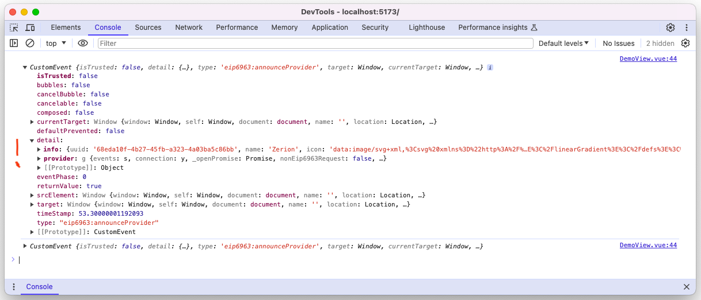
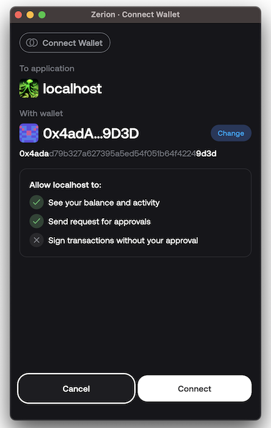

# Interactive [EIP-6963](https://eips.ethereum.org/EIPS/eip-6963) Tutorial

## Overview

This tutorial will guide you in transforming the Web3 user experience by contributing to the development
of [EIP-6963: Multi Injected Provider Discovery](https://eips.ethereum.org/EIPS/eip-6963). This Ethereum Improvement
Proposal (EIP) is designed to boost connectivity in the blockchain space by offering an alternative discovery mechanism
to `window.ethereum`.

By enabling the discovery of multiple injected wallet providers, [EIP-6963](https://eips.ethereum.org/EIPS/eip-6963) not
only simplifies wallet interactions for developers, but also gives them more control over their decentralized
applications (DApps).

For end-users, it enhances the user experience by allowing them to use any installed wallet of their choice, thus
facilitating seamless communication between DApps and browser extension wallets.

---

## Objective

The primary goal of this tutorial is to speed up the adoption of [EIP-6963](https://eips.ethereum.org/EIPS/eip-6963)
among DApp developers and the broader blockchain community. It aims to make the integration of wallet providers into the
decentralized ecosystem not only more intuitive but also more reliable. This guide serves as a comprehensive resource,
equipping you with the knowledge and tools to implement [EIP-6963](https://eips.ethereum.org/EIPS/eip-6963) within your
DApp in just 15 minutes.

For developers, this means less time spent on understanding the complexities of wallet provider integration and more
time dedicated to creating remarkable DApps.

By working together, it's possible to enhance the blockchain space, making it more accessible and efficient for
everyone.

---

## Using Existing Libraries

Here is the list of ready-to-use libraries that already support [EIP-6963](https://eips.ethereum.org/EIPS/eip-6963) to push your DApp to the new level. 

If you are already using one of them — consider updating to the latest version.

-  [wagmi](https://github.com/wevm/wagmi) / [mipd](https://github.com/wevm/mipd)
-  [rainbowkit](https://github.com/rainbow-me/rainbowkit)
-  [web3modal](https://github.com/WalletConnect/web3modal)
-  [connectkit](https://github.com/family/connectkit)
-  [web3-onboard](https://github.com/blocknative/web3-onboard)

---

## Quick Start

Get your hands on a ready-to-use **InjectedWalletProvider** setup right away. Simply add this file into your project,
and you'll be all set to connect your DApp with [EIP-6963](https://eips.ethereum.org/EIPS/eip-6963) in a moment:

<details>
<summary>InjectedWalletProvider implementation</summary>


[injected-wallet-provider.ts](src/injected-wallet-provider/injected-wallet-provider.ts)

[types.ts](src/injected-wallet-provider/types.ts)

</details>

Later in this tutorial, we'll construct this implementation step by step to give you a comprehensive understanding of
its internal mechanics.

---

## The Roadmap

This guide will take you step by step through the exciting journey of implementing *
*[EIP-6963: Multi Injected Provider Discovery](https://eips.ethereum.org/EIPS/eip-6963)** from scratch. It's organized
into a series of straightforward sections:

### 📖 Section 1: Requesting Available Providers

Dive into the mechanics of 'requestProvider' and 'announceProvider' events and understand their roles. This section will
clarify how DApps can initiate connections with multiple injected wallet providers and will provide examples of these
and related interfaces essential for wallet communication.

Explore the connection flow in step 1 of the [interactive tutorial](https://main.eip-6963-tutorial.pages.dev/).

### 📖 Section 2: Connecting to Wallet Accounts

This section will show you how to connect available provider wallets and how wallet extensions keep accounts connected
after a page refresh or on next visit.

Discover why [EIP-6963](https://eips.ethereum.org/EIPS/eip-6963) is a game-changer for DApp users, offering them the
freedom to connect with their wallet of choice, moving beyond the limitations of `window.ethereum`.

Experiment with requesting accounts and ensuring they stay connected in step 2 of
the [interactive tutorial](https://main.eip-6963-tutorial.pages.dev/).

### 📖 Section 3: Message Signing and Sending a Transaction

Learn how your DApp can leverage connected wallet providers to sign transactions with the user's preferred wallet. This
section is all about putting theory into practice.

Get hands-on with account connection and transaction signing in steps 3-4 of
the [interactive tutorial](https://main.eip-6963-tutorial.pages.dev/).

### 📖 Section 4: 🗄️ Using localStorage for Persistence

Understand the importance of persistence in maintaining a seamless user experience across DApp sessions. This section
will guide you through the practical aspects of using localStorage to remember user preferences and wallet connections.

See it in action in the step 5 of the [interactive tutorial](https://main.eip-6963-tutorial.pages.dev/).

---

This tutorial will reference three key files from the repository:

**// 📁 file:  [injected-wallet-provider.ts](src/injected-wallet-provider/injected-wallet-provider.ts)** — where the core
logic for the [EIP-6963](https://eips.ethereum.org/EIPS/eip-6963) implementation resides

**// 📁 file:  [types.ts](src/injected-wallet-provider/types.ts)** — additional classes and interfaces that are essential
for the InjectedWalletProvider to function

**// 📁 file:  [DemoView.vue](src/components/DemoView.vue)** — the demo page of the tutorial, it uses the
InjectedWalletProvider to showcase how [EIP-6963](https://eips.ethereum.org/EIPS/eip-6963) operates

---

## Try It Out!

Ready to dive in? The interactive playground is all set up for you to try out everything you've learned in this guide.
It's the perfect place to experience how [EIP-6963](https://eips.ethereum.org/EIPS/eip-6963) operates in a real-world
setting.

Just pop over to the [interactive playground](https://main.eip-6963-tutorial.pages.dev/) and let the exploration begin.
It's a practical way to grasp how today's DApps can connect to a wallet
using [EIP-6963](https://eips.ethereum.org/EIPS/eip-6963).

This guide is all about learning by doing. Let's walk through the steps you'll be taking in
the [interactive tutorial](https://main.eip-6963-tutorial.pages.dev/) or on your local machine:

### Steps 1-2: Connection Flow

In these steps, you'll learn about the 'requestProvider' and 'announceProvider' events and how they work. You'll gain a
clear understanding of how DApps can initiate connections with multiple injected wallet providers. You'll also see
examples of these and related interfaces that are crucial for communicating with the wallets.

### Steps 3-4: Message Signing and Sending a Transaction

In these final steps, you'll see how your DApp can utilize connected wallet providers to sign transactions using their
preferred wallet.

### Step 5: Wallet Persistence Handling

This step will guide you through saving a preferred wallet provider in localStorage for reuse, whether after refreshing
the page or on your next visit. This introduces a fantastic new feature brought to you
by [EIP-6963](https://eips.ethereum.org/EIPS/eip-6963), offering your DApp users the freedom to connect with their
chosen wallet, moving away from the constraints of only using the wallet provided by `window.ethereum`.

---

## 📖 Section 0: Getting things ready

To get the most out of this tutorial, you'll need at least one [EIP-6963](https://eips.ethereum.org/EIPS/eip-6963)
compatible wallet. But hey, remember what this EIP is about? Get two or three!

Here's a list of wallets that have already rolled out support for [EIP-6963](https://eips.ethereum.org/EIPS/eip-6963):

- [Metamask](https://metamask.io/download/)
- [Zerion](https://zerion.io/download)
- [Coinbase](www.coinbase.com/en-de/wallet/download)
- [Brave](https://brave.com/wallet/)

... and so many more are available [here](https://github.com/WalletConnect/EIP6963/blob/master/src/utils/constants.ts).

#### Clone the repository

```bash
git clone git@github.com:nfwsncked/eip-6963-tutorial.git
```

#### Navigate into the project directory

```bash
cd eip-6963-tutorial
```

#### Make sure installing all the deps

```bash
npm i
```

#### Run the project locally

```bash
npm run dev
```

#### Open served app in your browser

```
http://localhost:5173/
```

---

## 📖 Section 1: Requesting Available Providers

Simplicity is the key to adoption.

The [EIP-6963](https://eips.ethereum.org/EIPS/eip-6963) protocol works in a pretty straightforward way:

A DApp can fire the `requestProvider` event at any moment, and as a reaction,
every [EIP-6963](https://eips.ethereum.org/EIPS/eip-6963) compatible wallet extension in your browser instantly
fires `announceProvider` event in response.

To see this interaction in action, let's add an event listener for `announceProvider` and emit the `requestProvider`
event.

First let's define all the necessary classes and interfaces in one go:

**// 📁 file:  [types.ts](src/injected-wallet-provider/types.ts)**

```typescript
// Declare a global interface to extend the WindowEventMap with a custom event "eip6963:announceProvider"
declare global {
    interface WindowEventMap {
        "eip6963:announceProvider": EIP6963AnnounceProviderEvent;
    }
}

// Define a class for the "eip6963:requestProvider" event
export class EIP6963RequestProviderEvent extends Event {
    constructor() {
        super("eip6963:requestProvider");
    }
}

// Define an interface for the "eip6963:announceProvider" event
export interface EIP6963AnnounceProviderEvent extends Event {
    type: "eip6963:announceProvider";
    detail: EIP6963ProviderDetail;
}

// Define an interface for the provider details
export interface EIP6963ProviderDetail {
    info: EIP6963ProviderInfo;
    provider: EIP1193Provider;
}

// Define an interface for the wallet extension metadata
export interface EIP6963ProviderInfo {
    uuid: string; // Unique identifier of the wallet extension announcement, keep in mind it changes on every request-announcement cycle
    name: string; // Name of the wallet extension
    icon: string; // Icon for the wallet extension
    rdns: string; // Reverse DNS name of the wallet extension
}

// Define an interface for the EIP1193 provider.
// It's the same interface we are used to access with 'window.ethereum'
export interface EIP1193Provider {
    request(request: {
        method: string;
        params?: Array<any> | Record<string, any>;
    }): Promise<any>;
}
```

---

The global interface **WindowEventMap** declaration above is used to extend the existing **WindowEventMap** interface
with a new event type, **'eip6963:announceProvider'**.

**EIP6963RequestProviderEvent** — an event class that's being fired to request the wallet providers;

**EIP6963AnnounceProviderEvent** — an interface that represents the response from the wallet extension when the **'
eip6963:requestProvider'** event is fired;

**EIP6963ProviderDetail** is the main object we're interested in here. It contains two important properties:

**EIP6963ProviderInfo** which exposes metadata about the wallet extension;

**EIP1193Provider** which is a provider interface from
the [EIP-1193 specification](https://eips.ethereum.org/EIPS/eip-1193#appendix-i-consumer-facing-api-documentation). This
should be used in the same way as the window.ethereum provider.

---

Now that we've got all the pieces in place, let's kick off the construction of a
simple [EIP-6963](https://eips.ethereum.org/EIPS/eip-6963) communication setup:

**// 📁 file:  [injected-wallet-provider.ts](src/injected-wallet-provider/injected-wallet-provider.ts)**

```typescript
export class InjectedWalletProvider extends EventEmitter {
    // This will hold the details of the providers received
    providerDetails: EIP6963ProviderDetail[];

...

    // This method processes the provider details announced and adds them to the providerDetails array
    private providerReceived(providerDetail: EIP6963ProviderDetail): void {
        this.providerDetails.push(providerDetail);
        this.emit('providerDetailsUpdated')
        this.log(`updated wallet provider details from '${providerDetail.info.name}' extension`);
    }

    // This method listens for the 'announceProvider' event and processes the provider details announced
    subscribe(): void {
        window.addEventListener("eip6963:announceProvider", (event: EIP6963AnnounceProviderEvent) => {
                this.log(`received 'announceProvider' emitted by ${event.detail.info.name} / ${event.detail.info.rdns}`);
                this.providerReceived(event.detail);
            }
        );
    }

    // This method is used to request wallet providers by firing a 'EIP6963RequestProviderEvent'
    requestProviders(): void {
        this.log("emitting 'requestProvider' event");
        this.providerDetails = [];
        window.dispatchEvent(new EIP6963RequestProviderEvent());
    }
}
```

First we have to call `subscribe` that will set up an event listener for `eip6963:announceProvider` event.
Next step is calling `requestProviders` to emit our request event.

Finally, we can see our events in the console:



Let's dive into the **detail** parameter of the **'EIP6963ProviderDetail'**. It has two parts: **info** and **provider
**.

### 📍 EIP6963ProviderDetail.info

First up, **info**. This is where the extension shares all its metadata with the DApp. We've already defined its
interface as — **EIP6963ProviderInfo**.

Let's break down the data points we received (find full descriptions
here: [EIP-6963 specification](https://eips.ethereum.org/EIPS/eip-6963#specification)):

**uuid** — a unique identifier for each wallet provider announcement, allowing different EIP-1193 provider sessions to
be distinguished

> ❗ Keep in mind that **uuid** changes with each announcement, so it's not a reliable way to consistently identify the
> wallet extension!

**name** — a user-friendly name of the Wallet Provider that can be displayed to the user on the DApp

**icon** — an encoded image that represents the wallet provider's logo

> ❗ For security reasons you should always wrap received **icon** into `` tag

**rdns** — a unique identifier provided by the wallet in the form of a reversed domain name (like
com.example.subdomain). It's expected to stay the same throughout the wallet's lifespan, providing a stable identifier
for DApps to rely on across sessions.

> ❗ **rdns** is a consistent parameter that helps us identify the wallet across different sessions. We'll use that later
> for persistency.

Example values:

```json
{
  "uuid": "36072975-ed89-4a55-a0d0-e7523f1413a8",
  "name": "Zerion",
  "icon": "data:image/svg+xml,%3Csvg%20xmlns%3D%22http%3A%2F%2Fwww.w3.org%2F2000%2Fsvg%22%20width%3D%22512%22%20height%3D%22512%22%20viewBox%3D%220%200%20512%20512%22%20fill%3D%22none%22%3E%3Crect%20width%3D%22512%22%20height%3D%22512%22%20rx%3D%22170.667%22%20fill%3D%22url%28%27%23paint0_linear_1098_5380%27%29%22%2F%3E%3Crect%20x%3D%2242.667%22%20y%3D%2242.667%22%20width%3D%22426.667%22%20height%3D%22426.667%22%20rx%3D%22170.667%22%20fill%3D%22%232461ED%22%2F%3E%3Cpath%20fill-rule%3D%22evenodd%22%20clip-rule%3D%22evenodd%22%20d%3D%22M286.757%20250.326c-41.73-22.55-92.506-51.794-130.72-75.629-11.276-8.123-5.553-25.364%208.074-25.364h189.086c10.548%200%2017.604%2011.761%2012.318%2020.66-12.706%2021.944-31.256%2049.805-46.75%2071.895-8.317%2011.857-21.872%2013.894-32.008%208.438Zm-60.862%207.323c40.349%2021.508%2096.895%2054.218%20137.074%2078.951%2012.415%207.663%207.468%2026.042-7.032%2026.042-23.728%200-62.285.007-100.641.013-37.961.006-75.725.012-98.726.012-11.59%200-17.531-12.027-12.609-20.417%2016.634-28.346%2035.33-56.959%2050.872-78.321%206.911-9.529%2020.975-11.663%2031.062-6.28Z%22%20fill%3D%22%23fff%22%2F%3E%3Cdefs%3E%3ClinearGradient%20id%3D%22paint0_linear_1098_5380%22%20x1%3D%220%22%20y1%3D%220%22%20x2%3D%22604.983%22%20y2%3D%22352.348%22%20gradientUnits%3D%22userSpaceOnUse%22%3E%3Cstop%20stop-color%3D%22%232962EF%22%2F%3E%3Cstop%20offset%3D%221%22%20stop-color%3D%22%23255CE5%22%2F%3E%3C%2FlinearGradient%3E%3C%2Fdefs%3E%3C%2Fsvg%3E",
  "rdns": "io.zerion.wallet"
}
```

```json
{
  "uuid": "f13cd14b-e30e-44b1-8ce7-2c4354ce1d9e",
  "name": "MetaMask",
  "icon": "data:image/svg+xml,%3Csvg%20fill%3D%22none%22%20height%3D%2233%22%20viewBox%3D%220%200%2035%2033%22%20width%3D%2235%22%20xmlns%3D%22http%3A%2F%2Fwww.w3.org%2F2000%2Fsvg%22%3E%3Cg%20stroke-linecap%3D%22round%22%20stroke-linejoin%3D%22round%22%20stroke-width%3D%22.25%22%3E%3Cpath%20d%3D%22m32.9582%201-13.1341%209.7183%202.4424-5.72731z%22%20fill%3D%22%23e17726%22%20stroke%3D%22%23e17726%22%2F%3E%3Cg%20fill%3D%22%23e27625%22%20stroke%3D%22%23e27625%22%3E%3Cpath%20d%3D%22m2.66296%201%2013.01714%209.809-2.3254-5.81802z%22%2F%3E%3Cpath%20d%3D%22m28.2295%2023.5335-3.4947%205.3386%207.4829%202.0603%202.1436-7.2823z%22%2F%3E%3Cpath%20d%3D%22m1.27281%2023.6501%202.13055%207.2823%207.46994-2.0603-3.48166-5.3386z%22%2F%3E%3Cpath%20d%3D%22m10.4706%2014.5149-2.0786%203.1358%207.405.3369-.2469-7.969z%22%2F%3E%3Cpath%20d%3D%22m25.1505%2014.5149-5.1575-4.58704-.1688%208.05974%207.4049-.3369z%22%2F%3E%3Cpath%20d%3D%22m10.8733%2028.8721%204.4819-2.1639-3.8583-3.0062z%22%2F%3E%3Cpath%20d%3D%22m20.2659%2026.7082%204.4689%202.1639-.6105-5.1701z%22%2F%3E%3C%2Fg%3E%3Cpath%20d%3D%22m24.7348%2028.8721-4.469-2.1639.3638%202.9025-.039%201.231z%22%20fill%3D%22%23d5bfb2%22%20stroke%3D%22%23d5bfb2%22%2F%3E%3Cpath%20d%3D%22m10.8732%2028.8721%204.1572%201.9696-.026-1.231.3508-2.9025z%22%20fill%3D%22%23d5bfb2%22%20stroke%3D%22%23d5bfb2%22%2F%3E%3Cpath%20d%3D%22m15.1084%2021.7842-3.7155-1.0884%202.6243-1.2051z%22%20fill%3D%22%23233447%22%20stroke%3D%22%23233447%22%2F%3E%3Cpath%20d%3D%22m20.5126%2021.7842%201.0913-2.2935%202.6372%201.2051z%22%20fill%3D%22%23233447%22%20stroke%3D%22%23233447%22%2F%3E%3Cpath%20d%3D%22m10.8733%2028.8721.6495-5.3386-4.13117.1167z%22%20fill%3D%22%23cc6228%22%20stroke%3D%22%23cc6228%22%2F%3E%3Cpath%20d%3D%22m24.0982%2023.5335.6366%205.3386%203.4946-5.2219z%22%20fill%3D%22%23cc6228%22%20stroke%3D%22%23cc6228%22%2F%3E%3Cpath%20d%3D%22m27.2291%2017.6507-7.405.3369.6885%203.7966%201.0913-2.2935%202.6372%201.2051z%22%20fill%3D%22%23cc6228%22%20stroke%3D%22%23cc6228%22%2F%3E%3Cpath%20d%3D%22m11.3929%2020.6958%202.6242-1.2051%201.0913%202.2935.6885-3.7966-7.40495-.3369z%22%20fill%3D%22%23cc6228%22%20stroke%3D%22%23cc6228%22%2F%3E%3Cpath%20d%3D%22m8.392%2017.6507%203.1049%206.0513-.1039-3.0062z%22%20fill%3D%22%23e27525%22%20stroke%3D%22%23e27525%22%2F%3E%3Cpath%20d%3D%22m24.2412%2020.6958-.1169%203.0062%203.1049-6.0513z%22%20fill%3D%22%23e27525%22%20stroke%3D%22%23e27525%22%2F%3E%3Cpath%20d%3D%22m15.797%2017.9876-.6886%203.7967.8704%204.4833.1949-5.9087z%22%20fill%3D%22%23e27525%22%20stroke%3D%22%23e27525%22%2F%3E%3Cpath%20d%3D%22m19.8242%2017.9876-.3638%202.3584.1819%205.9216.8704-4.4833z%22%20fill%3D%22%23e27525%22%20stroke%3D%22%23e27525%22%2F%3E%3Cpath%20d%3D%22m20.5127%2021.7842-.8704%204.4834.6236.4406%203.8584-3.0062.1169-3.0062z%22%20fill%3D%22%23f5841f%22%20stroke%3D%22%23f5841f%22%2F%3E%3Cpath%20d%3D%22m11.3929%2020.6958.104%203.0062%203.8583%203.0062.6236-.4406-.8704-4.4834z%22%20fill%3D%22%23f5841f%22%20stroke%3D%22%23f5841f%22%2F%3E%3Cpath%20d%3D%22m20.5906%2030.8417.039-1.231-.3378-.2851h-4.9626l-.3248.2851.026%201.231-4.1572-1.9696%201.4551%201.1921%202.9489%202.0344h5.0536l2.962-2.0344%201.442-1.1921z%22%20fill%3D%22%23c0ac9d%22%20stroke%3D%22%23c0ac9d%22%2F%3E%3Cpath%20d%3D%22m20.2659%2026.7082-.6236-.4406h-3.6635l-.6236.4406-.3508%202.9025.3248-.2851h4.9626l.3378.2851z%22%20fill%3D%22%23161616%22%20stroke%3D%22%23161616%22%2F%3E%3Cpath%20d%3D%22m33.5168%2011.3532%201.1043-5.36447-1.6629-4.98873-12.6923%209.3944%204.8846%204.1205%206.8983%202.0085%201.52-1.7752-.6626-.4795%201.0523-.9588-.8054-.622%201.0523-.8034z%22%20fill%3D%22%23763e1a%22%20stroke%3D%22%23763e1a%22%2F%3E%3Cpath%20d%3D%22m1%205.98873%201.11724%205.36447-.71451.5313%201.06527.8034-.80545.622%201.05228.9588-.66255.4795%201.51997%201.7752%206.89835-2.0085%204.8846-4.1205-12.69233-9.3944z%22%20fill%3D%22%23763e1a%22%20stroke%3D%22%23763e1a%22%2F%3E%3Cpath%20d%3D%22m32.0489%2016.5234-6.8983-2.0085%202.0786%203.1358-3.1049%206.0513%204.1052-.0519h6.1318z%22%20fill%3D%22%23f5841f%22%20stroke%3D%22%23f5841f%22%2F%3E%3Cpath%20d%3D%22m10.4705%2014.5149-6.89828%202.0085-2.29944%207.1267h6.11883l4.10519.0519-3.10487-6.0513z%22%20fill%3D%22%23f5841f%22%20stroke%3D%22%23f5841f%22%2F%3E%3Cpath%20d%3D%22m19.8241%2017.9876.4417-7.5932%202.0007-5.4034h-8.9119l2.0006%205.4034.4417%207.5932.1689%202.3842.013%205.8958h3.6635l.013-5.8958z%22%20fill%3D%22%23f5841f%22%20stroke%3D%22%23f5841f%22%2F%3E%3C%2Fg%3E%3C%2Fsvg%3E",
  "rdns": "io.metamask"
}
```

### 📍 EIP6963ProviderDetail.provider

The second part of the **'EIP6963ProviderDetail'** is the **provider**. This is an interface, known as **EIP1193Provider
**, that acts like a gateway to the user's account. You can use it in the same way you'd use **window.ethereum**.

The **EIP1193Provider** interface is a standard way for Ethereum wallets to talk to DApps. It's main usage is
the `request` method, this method takes a request object as a parameter: object should have a `method` property (a
string that names the method to be called) and it can also have a `params` property (this can be an array or an object,
and it holds the parameters for the method call). The `request` method gives back a Promise that resolves to the result
of the method call. This lets DApps interact with the Ethereum blockchain in a way that doesn't block the user
interface.

Example calls you usually make:

```typescript
await provider.request({method: 'eth_accounts'})

await provider.request({
    method: 'personal_sign',
    params: ['some message to sign', '0x0000000000000000000000000000000000000000']
});
```

## 📖 Section 2: Connecting to Wallet Accounts

When you want to access Ethereum accounts, you can use either `eth_requestAccounts` or `eth_accounts`.

**The difference?** `eth_requestAccounts` prompts the user to connect their wallet via the extension interface,
while `eth_accounts` simply returns a list of accounts already connected and available to the DApp.

Once the DApp requests access to the accounts, they stay connected. This means you only need to request access once. The
wallet extension takes care of persisting these connections.

### 🔐 eth_requestAccounts

To establish a connection with the accounts in the wallet extension, we should simply call **'eth_requestAccounts'**:

**// 📁 file:  [DemoView.vue](src/components/DemoView.vue)**

```typescript
async function connectWalletAccount(providerDetail: EIP6963ProviderDetail) {
    try {
        const accounts = await providerDetail.provider.request({method: 'eth_requestAccounts'})
        setCurrentWalletAccount(accounts[0])
    } catch (e) {
        console.error(`error getting account: ${e}`);
    }
}
```

This action will prompt the selected wallet extension provider to display a dialog box, asking for permission to connect
to the available account:



You will see the following in the console:

`current account has been set to: 0x4adad79b327a627395a5ed54f051b64f42249d3d`

Which means our DApp successfully got the ethereum account from the extension

### 🔓 eth_accounts

To get accounts previously connected via `eth_requestAccounts`, we should use method **'eth_accounts'**:

**// 📁 file:  [DemoView.vue](src/components/DemoView.vue)**

```typescript
async function getConnectedWalletAccount(providerDetail: EIP6963ProviderDetail) {
    const accounts = await providerDetail.provider.request({method: 'eth_accounts'})
    if (accounts) {
        setCurrentWalletAccount(accounts[0])
    }
}
```

## 📖 Section 3: Message Signing and Sending a Transaction

In this part of the guide, you'll learn how modern DApps can leverage connected wallet providers to sign transactions in
a secure manner.

Let's start with an example of signing a string with the selected wallet:

```typescript
// signs a message by requesting the 'personal_sign' method from the provider
async function signMessage(providerDetail: EIP6963ProviderDetail) {
    try {
        const msg = signatureInputText.value;
        const signature = await providerDetail.provider.request({
            method: 'personal_sign',
            params: [msg, currentAccountAddress.value]
        });
        const signatureLog = `signed '${signatureInputText.value}' with ${providerDetail.info.name}, signature: ${signature}`;
        console.log(signatureLog);
        signatures.value.push(signatureLog);
    } catch (error) {
        console.error(`error signing: ${error}`);
    }
}
```

Now we can utilize **'eth_sendTransaction'** to send a transaction into the network:

```typescript
// sends a transaction by requesting the 'eth_sendTransaction' method from the provider
async function sendTransaction(providerDetail: EIP6963ProviderDetail) {
    // this is a demo implementation to avoid excesive dependencies
    // for production-ready apps you should use ethers / web3.js or bn.js to properly work with BigNumbers
    const value = `0x${parseInt(txValue.value).toString(16)}`;
    try {
        const transactionParameters = {
            to: txToAddress.value,
            from: currentAccountAddress.value,
            value: value,
        };
        const txHash = await providerDetail.provider.request({
            method: 'eth_sendTransaction',
            params: [transactionParameters],
        });
        console.log(`transaction sent with hash: ${txHash}`);
    } catch (error) {
        console.error(`error sending transaction: ${error}`);
    }
}
```

## 📖 Section 4: 🗄️ Using localStorage for persistence

Thanks to [EIP-6963](https://eips.ethereum.org/EIPS/eip-6963), it's now possible to use multiple wallet extensions at
the same time. This opens up a scenario where you might want to stick with the same wallet extension every time you use
this DApp. To make this happen, we can save your choice in localStorage using the RDNS value of the chosen extension.
Just a quick reminder, the RDNS parameter is a unique identifier that each wallet extension provides.

**// 📁 file:  [injected-wallet-provider.ts](src/injected-wallet-provider/injected-wallet-provider.ts)**

```typescript
  // This function stores the default provider.info.rdns in the local storage
storeDefaultProviderRdns(providerRdns
:
string
)
{
    window.localStorage.setItem(defaultProviderLocalStorageName, providerRdns);
    this.log(`stored default provider rdns '${providerRdns}' in local storage.`);
}

// This function retrieves the default provider.info.rdns from the local storage
readDefaultProviderRdns()
:
string | null
{
    const providerRdns = window.localStorage.getItem(defaultProviderLocalStorageName);
    this.log(`read default provider rdns '${providerRdns}' from local storage.`);
    return providerRdns;
}

// This function removes the default provider.info.rdns from the local storage
removeDefaultProvider()
{
    window.localStorage.removeItem(defaultProviderLocalStorageName);
    this.log("removed default provider rdns from local storage");
}
```